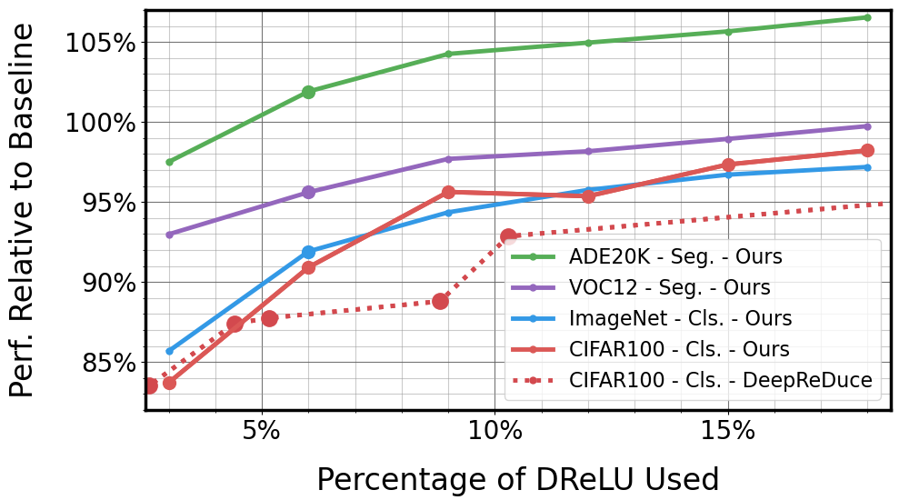

# Securing Neural Networks with Knapsack Optimization
Created by [Yakir Gorski](https://arxiv.org/search/cs?searchtype=author&query=Gorski%2C+Y)1 and [Shai Avidan](http://www.eng.tau.ac.il/~avidan/)1.  
1Tel Aviv University&nbsp;

## Introduction:
Deep learning inference brings together the data and the Convolutional Neural Network (CNN). This is problematic in case the user wants to preserve the privacy of the data and the service provider does not want to reveal the weights of his CNN. Secure Inference allows the two parties to engage in a protocol that preserves their respective privacy concerns, while revealing only the inference result to the user. This is known as Multi-Party Computation (MPC). A major bottleneck of MPC algorithms is communication, as the parties must send data back and forth. The linear component of a CNN (i.e. convolutions) can be done efficiently with minimal communication, but the non-linear part (i.e., ReLU) requires the bulk of communication bandwidth. We propose two ways to accelerate Secure Inference. The first is based on the observation that the ReLU outcome of many convolutions is highly correlated. Therefore, we replace the per pixel ReLU operation by a ReLU operation per patch. Each layer in the network will benefit from a patch of a different size and we devise an algorithm to choose the optimal set of patch sizes through a novel reduction of the problem to a knapsack problem. The second way to accelerate Secure Inference is based on cutting the number of bit comparisons required for a secure ReLU operation. We demonstrate the cumulative effect of these tools in the semi-honest secure 3-party setting for four problems: Classifying ImageNet using ResNet50 backbone, classifying CIFAR100 using ResNet18 backbone, semantic segmentation of ADE20K using MobileNetV2 backbone and semantic segmentation of Pascal VOC 2012 using ResNet50 backbone.

## Citation
If you find our work useful in your research, please consider citing:

    @misc{gorski2023securing,
          title={Securing Neural Networks with Knapsack Optimization}, 
          author={Yakir Gorski and Shai Avidan},
          year={2023},
          eprint={2304.10442},
          archivePrefix={arXiv},
          primaryClass={cs.CV}
    }

## Environment Setup:
### We provide a docker file under: docker/Dockerfile
- **Build the docker image:**
    - cd docker; docker build -t secure_inference .
    - A dockerhub image will be available after the review process.
- **To manually build the environment:**
    - sudo apt-get update
    - curl -O https://repo.anaconda.com/archive/Anaconda3-2019.03-Linux-x86_64.sh
    - sudo apt-get install bzip2
    - bash Anaconda3-2019.03-Linux-x86_64.sh
    - conda create -n secure-inference python=3.7 -y
    - conda activate secure-inference
    - conda install pytorch=1.6.0 torchvision cudatoolkit=10.1 -c pytorch
    - pip install mmcv-full==1.5.3 -f https://download.openmmlab.com/mmcv/dist/cu101/torch1.6.0/index.html
    - pip install mmsegmentation
    - sudo apt-get install ffmpeg libsm6 libxext6  -y
    - conda install numba
    - conda install tqdm

## Training:

**All models and block ReLU specs can be found [here](https://drive.google.com/drive/folders/1HkLH8zaTLRnnQNUwafGguFZaAkN9A_Cb?usp=sharing)**. Datasets can be downloaded based on OpenMMLab instructions.

Segmentation, MobileNetV2, ADE20K
 

- [Original config file](https://github.com/open-mmlab/mmsegmentation/blob/master/configs/mobilenet_v2/deeplabv3_m-v2-d8_512x512_160k_ade20k.py)
- **First, we extract distortion for each channel and each block size by running:** 
    - python research/extract_block_sizes.py --config research/configs/segmentation/mobilenet_v2/deeplabv3_m-v2-d8_512x512_160k_ade20k.py --checkpoint {PATH_TO_MMLAB_MODELS}/deeplabv3_m-v2-d8_512x512_160k_ade20k_20200825_223255-63986343.pth --output_path {WORK_DIR}/segmentation/mobilenet_ade/distortion/ --num_samples NUM_SAMPLES --num_gpus NUM_GPUS 
    - we used NUM_SAMPLES=48 over NUM_GPUS=4
    - We used OpenMMLab [model](https://download.openmmlab.com/mmsegmentation/v0.5/mobilenet_v2/deeplabv3_m-v2-d8_512x512_160k_ade20k/deeplabv3_m-v2-d8_512x512_160k_ade20k_20200825_223255-63986343.pth)
- **Now we are ready to get the knapsack optimal patch-sizes by running:**
  - export PYTHONPATH=. ; python research/distortion/knapsack/knapsack_patch_size_extractor.py --config research/configs/segmentation/mobilenet_v2/deeplabv3_m-v2-d8_512x512_160k_ade20k_relu.py --block_size_spec_file_name {WORK_DIR}/segmentation/mobilenet_ade/distortion/block_spec/0.06.pickle --channel_distortion_path  {WORK_DIR}/mobilenet_ade/distortion/distortion_collected/ --ratio 0.06
  - Here we use 6% DReLU budget
- **Finally, we can train the network**
  - export PYTHONPATH=. ; bash ./research/mmlab_tools/segmentation/dist_train.sh research/configs/segmentation/mobilenet_v2/deeplabev2_mobilenet_ade20k_finetune.py 4 --load-from {PATH_TO_MMLAB_MODELS}/deeplabv3_m-v2-d8_512x512_160k_ade20k_20200825_223255-63986343.pth --work-dir
    {WORK_DIR}/segmentation/mobilenet_ade/experiments/0.06 --relu-spec-file
    {WORK_DIR}/segmentation/mobilenet_ade/distortion/block_spec/0.06.pickle

Segmentation, ResNet50, Pascal VOC 2012
 

- [Original config file](https://github.com/open-mmlab/mmsegmentation/blob/master/configs/deeplabv3/deeplabv3_r50-d8_512x512_40k_voc12aug.py)
- **First, we replace the MaxPool layer with an AvgPool layer and finetune by running:** 
    - export PYTHONPATH=. ; bash ./research/mmlab_tools/segmentation/dist_train.sh research/configs/segmentation/deeplabv3/deeplabv3_r50-d8_512x512_40k_voc12aug_avg_pool.py 4 --load-from {PATH_TO_MMLAB_MODELS}/deeplabv3_r50-d8_512x512_40k_voc12aug_20200613_161546-2ae96e7e.pth --work-dir
      {WORK_DIR}/segmentation/resnet_voc/avg_pool
    - We used OpenMMLab [model](https://download.openmmlab.com/mmsegmentation/v0.5/deeplabv3/deeplabv3_r50-d8_512x512_40k_voc12aug/deeplabv3_r50-d8_512x512_40k_voc12aug_20200613_161546-2ae96e7e.pth)
- **Next, we extract distortion for each channel and each block size by running:**
    - export  PYTHONPATH=. ; python research/extract_block_sizes.py --config research/configs/segmentation/deeplabv3/deeplabv3_r50-d8_512x512_40k_voc12aug_avg_pool.py --checkpoint
      {WORK_DIR}/segmentation/resnet_voc/avg_pool/iter_3000.pth --output_path {WORK_DIR}/segmentation/resnet_voc/distortion/ --num_samples NUM_SAMPLES --num_gpus NUM_GPUS 
    - we used NUM_SAMPLES=30 over NUM_GPUS=5
- **Now we are ready to get the knapsack optimal patch-sizes by running:**
  - python research/distortion/knapsack/knapsack_patch_size_extractor.py --block_size_spec_file_name {WORK_DIR}/segmentation/resnet_voc/distortion/block_spec/0.06.pickle --channel_distortion_path {WORK_DIR}/segmentation/resnet_voc/distortion/distortion_collected/ --config research/configs/segmentation/deeplabv3/deeplabv3_r50-d8_512x512_40k_voc12aug_avg_pool.py --max_cost 7644149
  - Here we use 6% DReLU budget
- **Finally, we finetune the network**
  - export PYTHONPATH=. ; bash ./research/mmlab_tools/segmentation/dist_train.sh research/configs/segmentation/deeplabv3/deeplabv3_r50-d8_512x512_40k_voc12aug_avg_pool_finetune.py 2 --load-from {WORK_DIR}/segmentation/resnet_voc/avg_pool/iter_3000.pth --work-dir {WORK_DIR}/segmentation/resnet_voc/experiments/0.06/ --relu-spec-file {WORK_DIR}/segmentation/resnet_voc/distortion/block_spec/0.06.pickle

Classification, ResNet50, ImageNet
 

- [Original config file](https://github.com/open-mmlab/mmclassification/blob/master/configs/resnet/resnet50_8xb32_in1k.py)
- **First, we replace the MaxPool layer with an AvgPool layer and finetune by running:**
    - ./research/mmlab_tools/classification/dist_train_cls.sh research/configs/classification/resnet/resnet50_in1k/resnet50_in1k_avg_pool.py 4 --load-from {PATH_TO_MMLAB_MODELS}/resnet50_8xb32_in1k_20210831-ea4938fc.pth --work-dir
      {WORK_DIR}/classification/resnet50_imagenet/avg_pool
    - We used OpenMMLab [model](https://download.openmmlab.com/mmclassification/v0/resnet/resnet50_8xb32_in1k_20210831-ea4938fc.pth)
- **Next, we extract disotrtion for each channel and each block size by running:** 
    - python research/extract_block_sizes.py --config research/configs/classification/resnet/resnet50_in1k/resnet50_in1k_avg_pool.py --checkpoint
      {WORK_DIR}/classification/resnet50_imagenet/avg_pool/epoch_15.pth --output_path {WORK_DIR}/classification/resnet_imagenet/distortion/ --num_samples NUM_SAMPLES --num_gpus NUM_GPUS 
    - we used NUM_SAMPLES=512 over NUM_GPUS=4
- **Now we are ready to get the knapsack optimal patch-sizes by running:**
    - export PYTHONPATH=. ; python research/distortion/knapsack/knapsack_patch_size_extractor.py --config research/configs/classification/resnet/resnet50_in1k/resnet50_in1k_avg_pool.py --block_size_spec_file_name
      {WORK_DIR}/classification/resnet50_imagenet/distortion/block_spec/0.06.pickle --channel_distortion_path
      {WORK_DIR}/classification/resnet50_imagenet/distortion/distortion_collected --ratio 0.06
    - Here we use 6% DReLU budget
- **Finally, we can train the network**
    - export PYTHONPATH=. ; bash ./research/mmlab_tools/classification/dist_train_cls.sh research/configs/classification/resnet/resnet50_in1k/resnet50_in1k_finetune.py 4 --load-from {WORK_DIR}/classification/resnet50_imagenet/avg_pool/epoch_15.pth --work-dir {WORK_DIR}/classification/resnet50_imagenet/experiments/0.06 --relu-spec-file {WORK_DIR}/classification/resnet50_imagenet/distortion/block_spec/0.06.pickle

 Classification, ResNet18, CIFAR100
 

- **OpenMMLab does not provide this model, therefore we train a model from scratch**
    - ./research/mmlab_tools/classification/dist_train_cls.sh research/configs/classification/resnet/resnet18_cifar100/baseline.py 2 --work-dir {WORK_DIR}/classification/resnet18_cifar100/baseline
- **Distortion extraction:**
    - export  PYTHONPATH=. ; python research/extract_block_sizes.py --config research/configs/classification/resnet/resnet18_cifar100/baseline.py --checkpoint {WORK_DIR}/classification/resnet18_cifar100/baseline/epoch_200.pth --output_path {WORK_DIR}/segmentation/resnet18_cifar100/distortion/ --num_samples NUM_SAMPLES --num_gpus NUM_GPUS
    - we used NUM_SAMPLES=2048 over NUM_GPUS=2
- **Now we are ready to get the knapsack optimal patch-sizes by running:**
    - export PYTHONPATH=. ; python research/distortion/knapsack/knapsack_patch_size_extractor.py --config research/configs/classification/resnet/resnet18_cifar100/baseline.py --block_size_spec_file_name
      {WORK_DIR}/classification/resnet18_cifar100/distortion/block_spec/0.06.pickle --channel_distortion_path
      {WORK_DIR}/classification/resnet18_cifar100/distortion/distortion_collected --ratio 0.06
    - Here we use 6% DReLU budget
- **Finetuning:**
    - ./research/mmlab_tools/classification/dist_train_cls.sh research/configs/classification/resnet/resnet18_cifar100/baseline_finetune.py 2 --load-from {WORK_DIR}/classification/resnet18_cifar100/baseline/epoch_200.pth --work-dir {WORK_DIR}/classification/resnet18_cifar100/experiments/0.06 --relu-spec-file {WORK_DIR}/classification/resnet18_cifar100/distortion/block_spec/0.06.pickle
  

## Secure Inference
- **Once we have a model and relu-spec file, we can run secure inference:**
    - Running inference in the same machine is as simple as executing:
        - ./research/secure_inference_3pc/exe_3_party_imagenet.sh
    - To run inference over different machines, we need to execute the relevant python file, and set addresses in research/secure_inference_3pc/base.py
    - To use approximate DReLU, change COMPARISON_NUM_BITS_IGNORED and NUM_OF_LSB_TO_IGNORE in research/secure_inference_3pc/const.py

## Extending Secure Inference
To extend secure inference to your own architecture

- Add distortion parameters file to distortion/parameters
- Add the proper line to distortion/parameters/factory.py
- Add the proper file to distortion/arch_utils
- Add the proper line to distortion/arch_utils/factor.py

## License
This project is licensed under the terms of the MIT license (see the [LICENSE](./LICENSE) file for more details).
